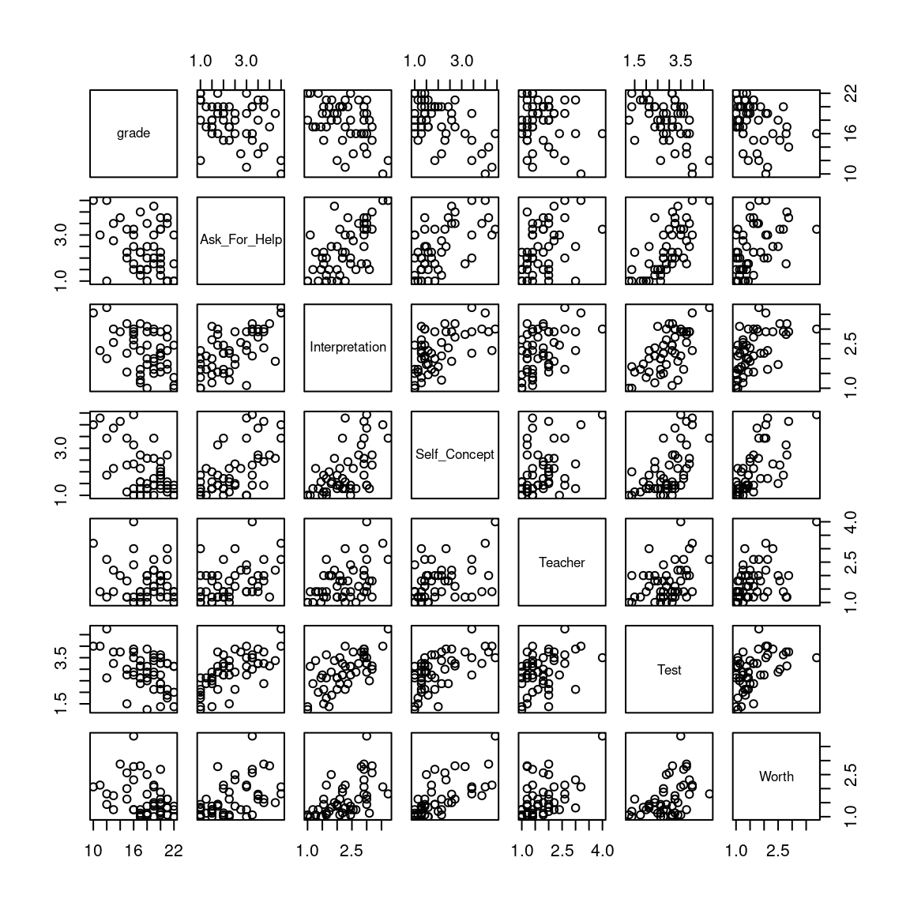

# Multiple Regression

## Resources

[Slides](slides/02_multreg/index.html)

My textbook chapter on [multiple regression](https://psyteachr.github.io/stat-models-v1/multiple-regression.html) covers a lot of the material in greater depth.

## Activity

For this set of exercises, you're going to be working with some real data collected about students from a previous year of student in statistics at the University of Glasgow. The data have been anonymized, and no demographic or other sensitive information has been provided. Each student is identified by a unique value of the variable `id`.

Students were given the STats Anxiety Rating Scale (STARS), a 51-item questionnaire which measures student's attitudes toward statistics [@cruise1985]. For each item, students are asked to rate either agreement with a statement on a 1 to 5 scale (1 = strongly disagree, 5 = strongly agree), or rate how anxious they would feel on a 1 to 5 scale (1 = no anxiety, 5 = strong anxiety). Higher numbers mean more anxiety or more negative attitudes toward statistics.  If you're interested, you can see the individual survey items below.


<div class='webex-solution'><button>Click here to view the 51 STARS items</button>


|item_id |item                                                                                                                                                        |subscale     |
|:-------|:-----------------------------------------------------------------------------------------------------------------------------------------------------------|:---------|
|i1      |Studying for an examination in a statistics course                                                                                                          |Anxiety   |
|i2      |Interpreting the meaning of a table in a journal article                                                                                                    |Anxiety   |
|i3      |Going to ask my statistics teacher for individual help with material I am having difficulty understanding                                                   |Anxiety   |
|i4      |Doing the coursework for a statistics course                                                                                                                |Anxiety   |
|i5      |Making an objective decision based on empirical data                                                                                                        |Anxiety   |
|i6      |Reading a journal article that includes some statistical analyses                                                                                           |Anxiety   |
|i7      |Trying to decide which analysis is appropriate for my research project                                                                                      |Anxiety   |
|i8      |Doing an examination in a statistics course                                                                                                                 |Anxiety   |
|i9      |Reading an advertisement for a car which includes figures on miles per gallon, depreciation, etc.                                                           |Anxiety   |
|i10     |Walking into the room to take a statistics test                                                                                                             |Anxiety   |
|i11     |Interpreting the meaning of a probability value once I have found it                                                                                        |Anxiety   |
|i12     |Arranging to have a body of data put into the computer                                                                                                      |Anxiety   |
|i13     |Finding that another student in class got a different answer than I did to a statistical problem                                                            |Anxiety   |
|i14     |Determining whether to reject or retain the null hypothesis                                                                                                 |Anxiety   |
|i15     |Waking up in the morning on the day of a statistics test                                                                                                    |Anxiety   |
|i16     |Asking one of your lecturers for help in understanding a printout                                                                                           |Anxiety   |
|i17     |Trying to understand the odds in a lottery                                                                                                                  |Anxiety   |
|i18     |Watching a student search through a load of computer printouts from his/her research                                                                        |Anxiety   |
|i19     |Asking someone in the computer lab for help in understanding a printout                                                                                     |Anxiety   |
|i20     |Trying to understand the statistical analyses described in the abstract of a journal article                                                                |Anxiety   |
|i21     |Enrolling in a statistics course                                                                                                                            |Anxiety   |
|i22     |Going over a final examination in statistics after it has been marked                                                                                       |Anxiety   |
|i23     |Asking a fellow student for help in understanding a printout                                                                                                |Anxiety   |
|i24     |I am a subjective person, so the objectivity of statistics is inappropriate for me                                                                          |Agreement |
|i25     |I have not done maths for a long time. I know I will have problems getting through statistics                                                               |Agreement |
|i26     |I wonder why I have to do all these things in statistics when in actual life I will never use them                                                          |Agreement |
|i27     |Statistics is worthless to me since it is empirical and my area of specialization is abstract                                                               |Agreement |
|i28     |Statistics takes more time than it is worth                                                                                                                 |Agreement |
|i29     |I feel statistics is a waste                                                                                                                                |Agreement |
|i30     |Statistics teachers are so abstract they seem inhuman                                                                                                       |Agreement |
|i31     |I cannot even understand secondary school maths; how can I possibly do statistics?                                                                          |Agreement |
|i32     |Most statistics teachers are not human                                                                                                                      |Agreement |
|i33     |I lived this long without knowing statistics, why should I learn it now?                                                                                    |Agreement |
|i34     |Since I have never enjoyed maths I do not see how I can enjoy statistics                                                                                    |Agreement |
|i35     |I do not want to learn to like statistics                                                                                                                   |Agreement |
|i36     |Statistics is for people who have a natural leaning toward maths                                                                                            |Agreement |
|i37     |Statistics is a pain I could do without                                                                                                                     |Agreement |
|i38     |I do not have enough brains to get through statistics                                                                                                       |Agreement |
|i39     |I could enjoy statistics if it were not so mathematical                                                                                                     |Agreement |
|i40     |I wish the statistics requirement would be removed from my academic program                                                                                 |Agreement |
|i41     |I do not understand why someone in my field needs statistics                                                                                                |Agreement |
|i42     |I do not see why I have to fill my head with statistics. It will have no use in my career                                                                   |Agreement |
|i43     |Statistics teachers speak a different language                                                                                                              |Agreement |
|i44     |Statisticians are more number oriented than they are people oriented                                                                                        |Agreement |
|i45     |I cannot tell you why, but I just do not like statistics                                                                                                    |Agreement |
|i46     |Statistics teachers talk so fast you cannot logically follow them                                                                                           |Agreement |
|i47     |Statistical figures are not fit for human consumption                                                                                                       |Agreement |
|i48     |Statistics is not really bad. It is just too mathematical                                                                                                   |Agreement |
|i49     |Affective (emotional) skills are so important in my (future) profession that I do not want to clutter my thinking with something as cognitive as statistics |Agreement |
|i50     |I am never going to use statistics so why should I have to take it?                                                                                         |Agreement |
|i51     |I am too slow in my thinking to get through statistics                                                                                                      |Agreement | 


</div>


The STARS items can be divided up into six different subscales [@hanna2008], which reflect different aspects of statistics training that students may feel anxiety toward: Asking For Help, Interpretation, Self Concept, Teacher, Test, and (Self-)Worth.

Students in this course were allowed to freely choose what software they used to perform the class assignments, either SPSS or R.

The data is in the file [stars-wide.csv](data/stars-wide.csv){target="_download"}

Your task is to use multiple regression examine the relationship between the stats anxiety subscales and overall performance in the class, as measured by the students' final grades.

## Tasks

Open up a new RMarkdown file and create separate code chunks for each of the following tasks. Alternatively, you can write your code into an R script and mark each task using comments.


### Import the data

:::{.try}

You will need to use the **`tidyverse`** package as well as the **`corrr`** package. Load in those packages and then import `stars-wide.csv`. You might want to look at the [Data Import Cheat Sheet](https://raw.githubusercontent.com/rstudio/cheatsheets/main/data-import.pdf){target="_blank"}.


<div class='webex-solution'><button>solution</button>

```r
library("tidyverse")
library("corrr")

stars <- read_csv("data/stars-wide.csv",
                  col_types = "iiddddddc")

## remember to look at your data before proceeding!
stars
```

```
## # A tibble: 50 × 9
##       id grade Ask_For_Help Interpretation Self_Concept Teacher  Test Worth
##    <int> <int>        <dbl>          <dbl>        <dbl>   <dbl> <dbl> <dbl>
##  1     3    18         1              1            1        1    1.25  1.06
##  2     7    15         3.25           3.18         2.29     1.8  3     2.56
##  3    12    18         2.5            1.8          1.5      2    2.88  2.5 
##  4    16    17         4              3.18         2.71     1.2  3.14  2.81
##  5    19    19         1.75           3            1.43     1.6  2.88  1.44
##  6    21    15         2              2.18         3.43     1.2  2.75  2   
##  7    23    20         1.75           1.55         1.86     2    2.12  1.44
##  8    24    22         1.75           2.45         1.43     1.2  3.12  1.38
##  9    26    22         1              1            1        1    1.38  1   
## 10    29    16         1.5            2.64         1.29     1    2.88  1.25
## # … with 40 more rows, and 1 more variable: software <chr>
```


</div>
:::


### Create a correlation matrix

:::{.try}

Create a correlation matrix using `corrr::correlate()` showing the bivariate correlation between your response variable (`grade`) and the six subscale means.


<div class='webex-solution'><button>hint</button>


Select the variables that you need and then use `correlate()` from the `corrr` package.


</div>


<div class='webex-solution'><button>solution</button>

```r
stars %>%
  select(-id, -software) %>%
  correlate() %>%
  shave(upper = TRUE) %>%
  fashion() %>%
  knitr::kable(align = "r")
```

```
## 
## Correlation method: 'pearson'
## Missing treated using: 'pairwise.complete.obs'
```

<table>
 <thead>
  <tr>
   <th style="text-align:right;"> term </th>
   <th style="text-align:right;"> grade </th>
   <th style="text-align:right;"> Ask_For_Help </th>
   <th style="text-align:right;"> Interpretation </th>
   <th style="text-align:right;"> Self_Concept </th>
   <th style="text-align:right;"> Teacher </th>
   <th style="text-align:right;"> Test </th>
   <th style="text-align:right;"> Worth </th>
  </tr>
 </thead>
<tbody>
  <tr>
   <td style="text-align:right;"> grade </td>
   <td style="text-align:right;">  </td>
   <td style="text-align:right;">  </td>
   <td style="text-align:right;">  </td>
   <td style="text-align:right;">  </td>
   <td style="text-align:right;">  </td>
   <td style="text-align:right;">  </td>
   <td style="text-align:right;">  </td>
  </tr>
  <tr>
   <td style="text-align:right;"> Ask_For_Help </td>
   <td style="text-align:right;"> -.35 </td>
   <td style="text-align:right;">  </td>
   <td style="text-align:right;">  </td>
   <td style="text-align:right;">  </td>
   <td style="text-align:right;">  </td>
   <td style="text-align:right;">  </td>
   <td style="text-align:right;">  </td>
  </tr>
  <tr>
   <td style="text-align:right;"> Interpretation </td>
   <td style="text-align:right;"> -.42 </td>
   <td style="text-align:right;"> .62 </td>
   <td style="text-align:right;">  </td>
   <td style="text-align:right;">  </td>
   <td style="text-align:right;">  </td>
   <td style="text-align:right;">  </td>
   <td style="text-align:right;">  </td>
  </tr>
  <tr>
   <td style="text-align:right;"> Self_Concept </td>
   <td style="text-align:right;"> -.59 </td>
   <td style="text-align:right;"> .60 </td>
   <td style="text-align:right;"> .58 </td>
   <td style="text-align:right;">  </td>
   <td style="text-align:right;">  </td>
   <td style="text-align:right;">  </td>
   <td style="text-align:right;">  </td>
  </tr>
  <tr>
   <td style="text-align:right;"> Teacher </td>
   <td style="text-align:right;"> -.14 </td>
   <td style="text-align:right;"> .42 </td>
   <td style="text-align:right;"> .45 </td>
   <td style="text-align:right;"> .41 </td>
   <td style="text-align:right;">  </td>
   <td style="text-align:right;">  </td>
   <td style="text-align:right;">  </td>
  </tr>
  <tr>
   <td style="text-align:right;"> Test </td>
   <td style="text-align:right;"> -.46 </td>
   <td style="text-align:right;"> .69 </td>
   <td style="text-align:right;"> .65 </td>
   <td style="text-align:right;"> .59 </td>
   <td style="text-align:right;"> .37 </td>
   <td style="text-align:right;">  </td>
   <td style="text-align:right;">  </td>
  </tr>
  <tr>
   <td style="text-align:right;"> Worth </td>
   <td style="text-align:right;"> -.34 </td>
   <td style="text-align:right;"> .47 </td>
   <td style="text-align:right;"> .55 </td>
   <td style="text-align:right;"> .70 </td>
   <td style="text-align:right;"> .46 </td>
   <td style="text-align:right;"> .47 </td>
   <td style="text-align:right;">  </td>
  </tr>
</tbody>
</table>


</div>

:::


### Visualize all pairwise correlations

:::{.try}

Now visualize all of the pairwise correlations.


<div class='webex-solution'><button>hint</button>


Use `pairs()`. See `?pairs` for help and examples.


</div>


<div class='webex-solution'><button>solution</button>

```r
stars %>%
  select(-id, -software) %>%
  pairs()
```


</div>

:::

### Run the multiple regression

:::{.try}

Estimate the parameters for the multiple regression, with grade as the response variable and the subscale means as the predictors. Don't forget to display your results using `summary()`, and take a moment to think about what all the numbers mean.


<div class='webex-solution'><button>hint</button>


`lm(dv ~ iv1 + iv2 + ..., data = ???)`


</div>


<div class='webex-solution'><button>solution</button>

```r
model <- lm(grade ~ Ask_For_Help + Interpretation + Self_Concept +
              Teacher + Test + Worth,
            data = stars)

summary(model)
```

```
## 
## Call:
## lm(formula = grade ~ Ask_For_Help + Interpretation + Self_Concept + 
##     Teacher + Test + Worth, data = stars)
## 
## Residuals:
##     Min      1Q  Median      3Q     Max 
## -5.6127 -1.6329  0.0755  1.6458  4.8041 
## 
## Coefficients:
##                Estimate Std. Error t value Pr(>|t|)    
## (Intercept)     22.3326     1.5704  14.221  < 2e-16 ***
## Ask_For_Help     0.3845     0.5227   0.736  0.46599    
## Interpretation  -0.6382     0.7675  -0.831  0.41032    
## Self_Concept    -1.8611     0.5806  -3.206  0.00254 ** 
## Teacher          0.6040     0.6394   0.945  0.35009    
## Test            -0.8344     0.7129  -1.170  0.24827    
## Worth            0.6492     0.8337   0.779  0.44044    
## ---
## Signif. codes:  0 '***' 0.001 '**' 0.01 '*' 0.05 '.' 0.1 ' ' 1
## 
## Residual standard error: 2.494 on 43 degrees of freedom
## Multiple R-squared:  0.4024,	Adjusted R-squared:  0.319 
## F-statistic: 4.826 on 6 and 43 DF,  p-value: 0.0007612
```


</div>
:::

### Which subscale is the 'best' predictor?

:::{.try}

Is there one subscale that is more strongly linked to the final grade? The different subscales have different variances, so you need to re-run the regression after standardizing the variables.


<div class='webex-solution'><button>hint</button>


calculate z-scores for each predictor; in tidyverse you can do this using

```
stars %>%
  mutate(zx = (x - mean(x)) / sd(x),
         zy = (y - mean(y)) / sd(y), ... etc)
```


</div>


<div class='webex-solution'><button>solution</button>

```r
## two ways to do this:
## 1. just type it all out
zscores1 <- stars %>%
  mutate(Ask_For_Help = (Ask_For_Help - mean(Ask_For_Help)) / sd(Ask_For_Help),
         Interpretation = (Interpretation - mean(Interpretation)) / sd(Interpretation),
         Self_Concept = (Self_Concept - mean(Self_Concept)) / sd(Self_Concept),
         Teacher = (Teacher - mean(Teacher)) / sd(Teacher),
         Test = (Test - mean(Test)) / sd(Test),
         Worth = (Worth - mean(Worth)) / sd(Worth))

## 2 (advanced). use 'scoping' variant of mutate; see ?mutate_at
zscores1 <- stars %>%
  mutate_at(vars(-id, -grade, -software), ~ (.x - mean(.x)) / sd(.x))

model_z <- lm(grade ~ Ask_For_Help + Interpretation + Self_Concept +
                Teacher + Test + Worth,
              data = zscores1)

summary(model_z)
```

```
## 
## Call:
## lm(formula = grade ~ Ask_For_Help + Interpretation + Self_Concept + 
##     Teacher + Test + Worth, data = zscores1)
## 
## Residuals:
##     Min      1Q  Median      3Q     Max 
## -5.6127 -1.6329  0.0755  1.6458  4.8041 
## 
## Coefficients:
##                Estimate Std. Error t value Pr(>|t|)    
## (Intercept)     17.7400     0.3527  50.293  < 2e-16 ***
## Ask_For_Help     0.3967     0.5393   0.736  0.46599    
## Interpretation  -0.4405     0.5299  -0.831  0.41032    
## Self_Concept    -1.8205     0.5679  -3.206  0.00254 ** 
## Teacher          0.3973     0.4206   0.945  0.35009    
## Test            -0.6414     0.5480  -1.170  0.24827    
## Worth            0.4092     0.5255   0.779  0.44044    
## ---
## Signif. codes:  0 '***' 0.001 '**' 0.01 '*' 0.05 '.' 0.1 ' ' 1
## 
## Residual standard error: 2.494 on 43 degrees of freedom
## Multiple R-squared:  0.4024,	Adjusted R-squared:  0.319 
## F-statistic: 4.826 on 6 and 43 DF,  p-value: 0.0007612
```


</div>
:::

### Compare models

:::{.try}

Could we do just as well predicting grades from the 'best' predictor as we could by including all six subscale predictors? Do an analysis to test this.


<div class='webex-solution'><button>hint</button>


Fit two models and compare using `anova()`


</div>


<div class='webex-solution'><button>solution</button>

```r
## we are doing it with the standardized scores;
## could also do it using the unstandardized scores and would get the same result
sc_only <- lm(grade ~ Self_Concept, zscores1)

anova(sc_only, model_z)
## no evidence for improvement by adding other 5 predictors!

summary(sc_only)
```

```
## Analysis of Variance Table
## 
## Model 1: grade ~ Self_Concept
## Model 2: grade ~ Ask_For_Help + Interpretation + Self_Concept + Teacher + 
##     Test + Worth
##   Res.Df    RSS Df Sum of Sq      F Pr(>F)
## 1     48 293.72                           
## 2     43 267.50  5    26.218 0.8429 0.5269
## 
## Call:
## lm(formula = grade ~ Self_Concept, data = zscores1)
## 
## Residuals:
##     Min      1Q  Median      3Q     Max 
## -6.0394 -1.5570  0.1842  2.1283  4.5136 
## 
## Coefficients:
##              Estimate Std. Error t value Pr(>|t|)    
## (Intercept)   17.7400     0.3498  50.710  < 2e-16 ***
## Self_Concept  -1.7722     0.3534  -5.015 7.66e-06 ***
## ---
## Signif. codes:  0 '***' 0.001 '**' 0.01 '*' 0.05 '.' 0.1 ' ' 1
## 
## Residual standard error: 2.474 on 48 degrees of freedom
## Multiple R-squared:  0.3438,	Adjusted R-squared:  0.3302 
## F-statistic: 25.15 on 1 and 48 DF,  p-value: 7.658e-06
```


</div>

:::

### Choice of software and grade

:::{.try}

Run a simple regression that predicts grades by choice of software (SPSS versus R).


<div class='webex-solution'><button>solution</button>

```r
model_gxs <- lm(grade ~ software, stars)

summary(model_gxs)
```

```
## 
## Call:
## lm(formula = grade ~ software, data = stars)
## 
## Residuals:
##     Min      1Q  Median      3Q     Max 
## -6.5000 -1.3235 -0.3235  2.2941  5.5000 
## 
## Coefficients:
##              Estimate Std. Error t value Pr(>|t|)    
## (Intercept)   18.3235     0.5021  36.493   <2e-16 ***
## softwareSPSS  -1.8235     0.8876  -2.054   0.0454 *  
## ---
## Signif. codes:  0 '***' 0.001 '**' 0.01 '*' 0.05 '.' 0.1 ' ' 1
## 
## Residual standard error: 2.928 on 48 degrees of freedom
## Multiple R-squared:  0.08082,	Adjusted R-squared:  0.06168 
## F-statistic: 4.221 on 1 and 48 DF,  p-value: 0.0454
```


</div>
:::
