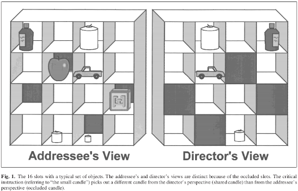
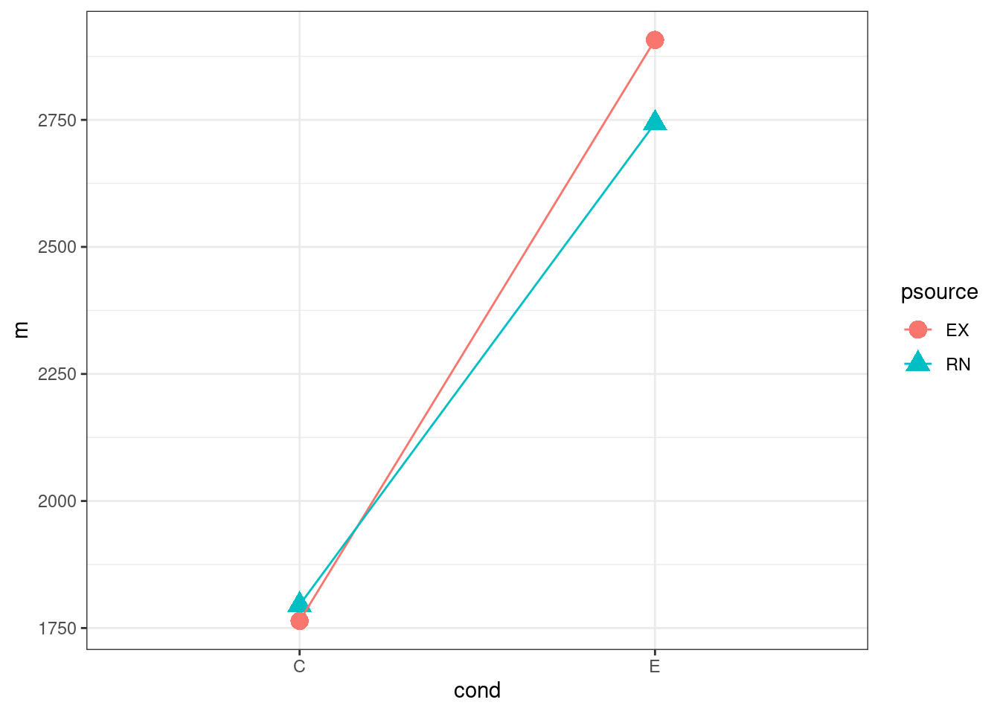

# Random effects structure

## Resources

[Slides](slides/07_simgen/index.html)

[Crossed web app](https://shiny.psy.gla.ac.uk/Dale/crossed) demonstrating random effects for a simple crossed design

## Maximal random effects

:::{.try}

For this first part, you will load in datasets created for you. Your task is to inspect the data and then to write the formula corresponding to the 'maximal' random effects structure.

Download the following files and place them in your working directory.

- [`fdata1.rds`](data/fdata1.rds)
- [`fdata2.rds`](data/fdata2.rds)
- [`fdata3.rds`](data/fdata3.rds)
- [`fdata4.rds`](data/fdata4.rds)

Then load them in using


```r
library("tidyverse")

fdata1 <- readRDS("fdata1.rds")
fdata2 <- readRDS("fdata2.rds")
fdata3 <- readRDS("fdata3.rds")
fdata4 <- readRDS("fdata4.rds")
```


The dataset `fdata1` is from a factorial experiment with design factors `C`, `E`, and `W` and dependent variable `rtime`. Individual subjects are identified by the variable `subject_id`.

Type the `lme4::lmer()` model formula you would use to analyze these data with maximal random effects (just the formula, e.g., `Y ~ Z + (Z | id)`, not the full `lmer()` call).

**You do not need to create numeric predictors to use in the formula. Just use `C`, `E`, and `W` as they are.**


<div class='webex-solution'><button>solution</button>

```r
rtime ~ C * E * W + (C * E * W | subject_id)
```


</div>

The dataset `fdata2` is from a factorial experiment with design factors `J`, `T`, and `W` and dependent variable `depvar`. Individual subjects are identified by the variable `subject_id`.

Type the `lme4::lmer()` model formula you would use to analyze these data with maximal random effects.


<div class='webex-solution'><button>solution</button>

```r
depvar ~ J * T * W + (W | subject_id)
```


</div>

The dataset `fdata3` is from a factorial experiment with independent variables `B`, `P`, and `U` and dependent variable `rtime`. The design includes crossed random factors of subjects and stimuli, with subjects identified by variable `subject_id`, and stimuli by variable `stim_id`.

Type the `lme4::lmer()` model formula you would use to analyze these data with maximal random effects.


<div class='webex-solution'><button>solution</button>

```r
rtime ~ B * P * U + (B * U | subject_id) + (P | stim_id)
```


</div>

The dataset `fdata4` is from a factorial experiment with independent variables `G`, `L`, and `T` and dependent variable `rtime`. The design includes crossed random factors of subjects and stimuli, with subjects identified by variable `sub_id`, and stimuli by variable `stm_id`.

Type the `lme4::lmer()` model formula you would use to analyze these data with maximal random effects.


<div class='webex-solution'><button>solution</button>

```r
rtime ~ G * L * T + (1 | sub_id) + (L | stm_id)
```


</div>
:::

## Re-analysis of Keysar, Barr, Balin & Brauner, Experiment 2

For this task, you will be re-analyzing data from **Experiment 2** of this paper:

Keysar, B., Barr, D. J., Balin, J. A. & Brauner, J. S. (2000). [Taking Perspective In Conversation: The Role of Mutual Knowledge In Comprehension](https://journals.sagepub.com/doi/abs/10.1111/1467-9280.00211). *Psychological Science*, 11, 32--38.



This experiment examined perspective taking during conversation. In the experiment, participants ("addressees") sat across from a confederate director who instructed them to move objects around in a grid placed between them while their eyes were tracked. For example, the director might say, "move the truck one space down." The grid contained some objects hidden from the director's view. The experiment was structured such that the director would occasionally refer to a mutually visible object ("move the small candle...") in a way that would also happen to describe a "competitor" object that was visible only to the addressee. Because this object was hidden the addressee had little reason to think the director would know of its identity.

For instance, consider that in the above figure the director sees two candles, a large and a small one, while the participant (addressee) sees three candles—the two that the director sees, plus a third one that is hidden, and even smaller than the director's "small" candle. To the extent that addressee's have difficulty taking the speaker's perspective, they should be confused by this additional candle that is privileged to them.

In addition to this main condition (indicated in the data by the `cond` variable having the value `E`), there was also a control condition where the hidden competitor (the addressee's smallest candle) was replaced with an object that would not match the description (indicated by `cond` being `C`).

The experiment previous to the one that you will re-analyse established that these hidden competitor produced "egocentric interference" that delayed interpretation.

In the current experiment (Experiment 2), the question was whether the "source" of these hidden objects mattered. In one condition (`psource = EX`) the experimenter gave the participants the objects to hide. In another condition (`psource = RN`), participants drew numbers from a bag, believing that this random lottery determined which objects went in the hidden spaces.

Thus, the experiment was a 2 (source, EX or RN) by 2 (condition, E or C) design. The experiment had crossed random factors of subject (`subj`) and stimulus (`object`), but was analyzed using separate by-subjects and by-items analysis. Your task is to re-analyze the analyses of the DVs `firstfix` and `rt` using linear mixed-effects model with appropriately specified random effects for subjects ('subj') and stimuli (`object`).

Make a new working directory, download the R binary (`.rds`) file [kbbb_2000.rds](data/kbbb_2000.rds), and place it in the directory. Start and new R script (or RMarkdown script) and save it in the working directory along with the data.

At the top of your script, type the following lines to set up your session (you might want to restart R before doing this):


```r
library("lme4")
library("tidyverse")

kbbb <- readRDS("kbbb_2000.rds")
```


Have a look at the tibble `kbbb`. A description of the fields is below.

| Variable | Description |
|:---------|:------------| 
| `subj`  | unique integer identifying each subject |
| `psource` | source of hidden objects (`EX` = experimenter, `RN` = random)   |
| `object`   | experimental stimulus identifier                                              |
| `cond`     | whether critical hidden object was competitor (`E`) or noncompetitor (`C`)    |
| `firstfix` | first fixation on the target (in milliseconds)                                |
| `rt`       | final fixation on the target (in milliseconds)                                |
| `regrab`   | reaches/grabs of critical hidden object (`R` = reach, `G` = grab, `-` = none) |
| `nfix`     | number of fixations on the critical hidden object                             |
| `totfix`   | total fixation time on critical hidden object (in milliseconds)               |

The DVs you should analyze is `firstfix`. 

From this point on, you're on your own. Don't peek at the solution until you have given it your best shot. Good luck!


<div class='webex-solution'><button>solution</button>


```r
## make deviation-coded predictors
kbbb2 <- kbbb %>%
  mutate(C = if_else(cond == "E", .5, -.5),
         PS = if_else(psource == "EX", .5, -.5))

## double check
kbbb2 %>%
  count(cond, psource, C, PS)
```

```
## # A tibble: 4 × 5
##   cond  psource     C    PS     n
##   <chr> <chr>   <dbl> <dbl> <int>
## 1 C     EX       -0.5   0.5   100
## 2 C     RN       -0.5  -0.5   100
## 3 E     EX        0.5   0.5   100
## 4 E     RN        0.5  -0.5   100
```

**First fixation analysis**


```r
## just get some descriptive stats
ff_means <- kbbb2 %>%
  group_by(psource, cond) %>%
  summarise(m = mean(firstfix, na.rm = TRUE), 
            sd = sd(firstfix, na.rm = TRUE),
            .groups = "drop")

ff_means
```

```
## # A tibble: 4 × 4
##   psource cond      m    sd
##   <chr>   <chr> <dbl> <dbl>
## 1 EX      C     1764. 1386.
## 2 EX      E     2907. 3312.
## 3 RN      C     1796. 1459.
## 4 RN      E     2743. 3513.
```

(*Note*: it's a good idea to plot the data before analysis as well, so we'll make a factorial plot)


```r
ggplot(ff_means, aes(cond, m, colour = psource)) +
  geom_point(aes(shape = psource), size = 4) +
  geom_line(aes(group = psource))
```



Check out the random effects structure, by subject.


```r
kbbb2 %>%
  count(subj, psource, cond)
```

```
## # A tibble: 80 × 4
##    subj  psource cond      n
##    <fct> <chr>   <chr> <int>
##  1 S01   EX      C         5
##  2 S01   EX      E         5
##  3 S02   EX      C         5
##  4 S02   EX      E         5
##  5 S04   RN      C         5
##  6 S04   RN      E         5
##  7 S05   RN      C         5
##  8 S05   RN      E         5
##  9 S06   EX      C         5
## 10 S06   EX      E         5
## # … with 70 more rows
```

Need a by-subject random slope for `cond`.

Check out the random effects structure, by stimulus.


```r
kbbb2 %>%
  count(object, psource, cond)
```

```
## # A tibble: 40 × 4
##    object psource cond      n
##    <fct>  <chr>   <chr> <int>
##  1 blkpen EX      C        10
##  2 blkpen EX      E        10
##  3 blkpen RN      C        10
##  4 blkpen RN      E        10
##  5 brush  EX      C        10
##  6 brush  EX      E        10
##  7 brush  RN      C        10
##  8 brush  RN      E        10
##  9 cards  EX      C        10
## 10 cards  EX      E        10
## # … with 30 more rows
```

Need by-stimulus random slopes for `psource`, `cond`, and their interaction.

Now we're ready to fit the model


```r
ff_mod <- lmer(firstfix ~ PS * C + (C | subj) + (PS * C | object), kbbb2,
               REML = FALSE) # for model comparison
```

```
## boundary (singular) fit: see help('isSingular')
```

```r
## we get boundary (singular) fit: see ?isSingular
## look at the results and see if we should simplify
summary(ff_mod) %>% print(corr = FALSE)
```

```
## Linear mixed model fit by maximum likelihood  ['lmerMod']
## Formula: firstfix ~ PS * C + (C | subj) + (PS * C | object)
##    Data: kbbb2
## 
##      AIC      BIC   logLik deviance df.resid 
##   7304.8   7376.5  -3634.4   7268.8      379 
## 
## Scaled residuals: 
##     Min      1Q  Median      3Q     Max 
## -2.7731 -0.4516 -0.1774  0.3196  7.3644 
## 
## Random effects:
##  Groups   Name        Variance Std.Dev. Corr          
##  subj     (Intercept)  530748   728.5                 
##           C           1240744  1113.9   1.00          
##  object   (Intercept) 1155349  1074.9                 
##           PS           241804   491.7   1.00          
##           C           1509480  1228.6   1.00 1.00     
##           PS:C         135969   368.7   1.00 1.00 1.00
##  Residual             4408340  2099.6                 
## Number of obs: 397, groups:  subj, 40; object, 10
## 
## Fixed effects:
##             Estimate Std. Error t value
## (Intercept)  2300.91     374.04   6.151
## PS             65.19     348.82   0.187
## C            1049.01     475.80   2.205
## PS:C          197.28     561.57   0.351
## optimizer (nloptwrap) convergence code: 0 (OK)
## boundary (singular) fit: see help('isSingular')
```


```r
ff_mod2 <- lmer(firstfix ~ PS * C + (C || subj) + (PS * C || object), kbbb2,
               REML = FALSE) # for model comparison
```

```
## boundary (singular) fit: see help('isSingular')
```

```r
## still, boundary (singular) fit: see ?isSingular
## look at the results and see if we should simplify
summary(ff_mod2) %>% print(corr = FALSE)
```

```
## Linear mixed model fit by maximum likelihood  ['lmerMod']
## Formula: firstfix ~ PS * C + ((1 | subj) + (0 + C | subj)) + ((1 | object) +  
##     (0 + PS | object) + (0 + C | object) + (0 + PS:C | object))
##    Data: kbbb2
## 
##      AIC      BIC   logLik deviance df.resid 
##   7332.4   7376.2  -3655.2   7310.4      386 
## 
## Scaled residuals: 
##     Min      1Q  Median      3Q     Max 
## -2.5222 -0.4645 -0.1832  0.2605  7.7264 
## 
## Random effects:
##  Groups   Name        Variance Std.Dev.
##  subj     (Intercept)  397373   630.4  
##  subj.1   C            474525   688.9  
##  object   (Intercept) 1102159  1049.8  
##  object.1 PS            59018   242.9  
##  object.2 C           1113391  1055.2  
##  object.3 PS:C              0     0.0  
##  Residual             4917572  2217.6  
## Number of obs: 397, groups:  subj, 40; object, 10
## 
## Fixed effects:
##             Estimate Std. Error t value
## (Intercept)  2301.52     364.07   6.322
## PS             66.24     308.59   0.215
## C            1047.79     415.68   2.521
## PS:C          195.19     495.80   0.394
## optimizer (nloptwrap) convergence code: 0 (OK)
## boundary (singular) fit: see help('isSingular')
```


```r
ff_mod3 <- lmer(firstfix ~ PS * C + (C || subj) + (PS + C || object), kbbb2,
               REML = FALSE) # for model comparison

summary(ff_mod3) %>% print(corr = FALSE)
```

```
## Linear mixed model fit by maximum likelihood  ['lmerMod']
## Formula: firstfix ~ PS * C + ((1 | subj) + (0 + C | subj)) + ((1 | object) +  
##     (0 + PS | object) + (0 + C | object))
##    Data: kbbb2
## 
##      AIC      BIC   logLik deviance df.resid 
##   7330.4   7370.3  -3655.2   7310.4      387 
## 
## Scaled residuals: 
##     Min      1Q  Median      3Q     Max 
## -2.5222 -0.4645 -0.1832  0.2605  7.7265 
## 
## Random effects:
##  Groups   Name        Variance Std.Dev.
##  subj     (Intercept)  397383   630.4  
##  subj.1   C            474304   688.7  
##  object   (Intercept) 1101968  1049.7  
##  object.1 PS            59073   243.0  
##  object.2 C           1113742  1055.3  
##  Residual             4917593  2217.6  
## Number of obs: 397, groups:  subj, 40; object, 10
## 
## Fixed effects:
##             Estimate Std. Error t value
## (Intercept)  2301.52     364.04   6.322
## PS             66.24     308.60   0.215
## C            1047.79     415.72   2.520
## PS:C          195.19     495.78   0.394
```


```r
ff_mod_PS <- update(ff_mod3, . ~ . -PS)
ff_mod_C <- update(ff_mod3, . ~ . -C)
ff_mod_PSC <- update(ff_mod3, . ~ . -PS:C)

## test of main effect of PS
anova(ff_mod_PS, ff_mod3)

## test of main effect of C
anova(ff_mod_C, ff_mod3)

## test of PS:C interaction
anova(ff_mod_PSC, ff_mod3)
```

```
## Data: kbbb2
## Models:
## ff_mod_PS: firstfix ~ C + (1 | subj) + (0 + C | subj) + (1 | object) + (0 + PS | object) + (0 + C | object) + PS:C
## ff_mod3: firstfix ~ PS * C + ((1 | subj) + (0 + C | subj)) + ((1 | object) + (0 + PS | object) + (0 + C | object))
##           npar    AIC    BIC  logLik deviance Chisq Df Pr(>Chisq)
## ff_mod_PS    9 7328.5 7364.3 -3655.2   7310.5                    
## ff_mod3     10 7330.4 7370.3 -3655.2   7310.4 0.046  1     0.8302
## Data: kbbb2
## Models:
## ff_mod_C: firstfix ~ PS + (1 | subj) + (0 + C | subj) + (1 | object) + (0 + PS | object) + (0 + C | object) + PS:C
## ff_mod3: firstfix ~ PS * C + ((1 | subj) + (0 + C | subj)) + ((1 | object) + (0 + PS | object) + (0 + C | object))
##          npar    AIC    BIC  logLik deviance  Chisq Df Pr(>Chisq)  
## ff_mod_C    9 7333.4 7369.3 -3657.7   7315.4                       
## ff_mod3    10 7330.4 7370.3 -3655.2   7310.4 4.9974  1    0.02539 *
## ---
## Signif. codes:  0 '***' 0.001 '**' 0.01 '*' 0.05 '.' 0.1 ' ' 1
## Data: kbbb2
## Models:
## ff_mod_PSC: firstfix ~ PS + C + (1 | subj) + (0 + C | subj) + (1 | object) + (0 + PS | object) + (0 + C | object)
## ff_mod3: firstfix ~ PS * C + ((1 | subj) + (0 + C | subj)) + ((1 | object) + (0 + PS | object) + (0 + C | object))
##            npar    AIC    BIC  logLik deviance  Chisq Df Pr(>Chisq)
## ff_mod_PSC    9 7328.6 7364.4 -3655.3   7310.6                     
## ff_mod3      10 7330.4 7370.3 -3655.2   7310.4 0.1547  1     0.6941
```
